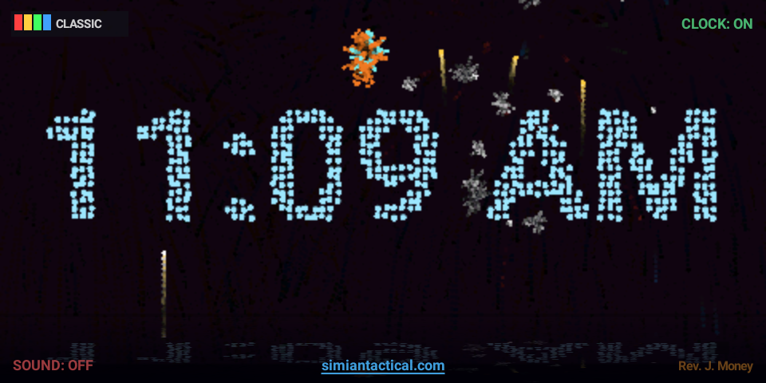
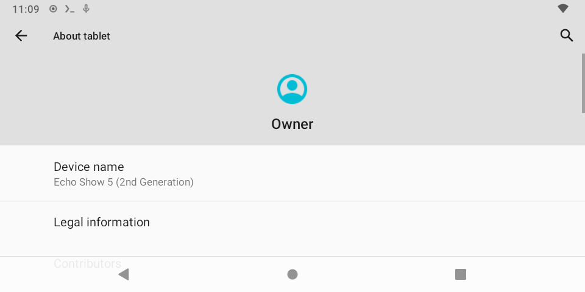

# oChe-checkmate-3ch0 🐒🔓
### Liberating the Amazon Echo Show 5 (2nd gen, codename **CRONOS**) — root, de-bloat, de-spy, and run your own apps.


> *A device that can't watch you, can't hear you, and can't phone home.* 👽🔇

> *"This thing is a piece of sh\*t at best when stock, I f\*\*king hate it."* — the author, ~6 hours before it became his favorite gadget.

This is a **lab-grade, reproducible writeup** of taking a locked-down, secure-booted, anti-rollback-fused Amazon Echo Show 5 (2nd gen) from a spy-clock appliance to a **fully rooted, de-Amazoned, Bluetooth-speaker, custom-app-running open Android panel** — with **Magisk root**, a third-party launcher, the surveillance ripped out, and home-built apps signed against the Android SDK.

Part of the **Simian Tactical Toolbox**. 🐒🔫

---

## 🎯 The endgame is LineageOS — but you can stop early

**The real goal of this whole project is to replace Fire OS with [LineageOS 18.1](docs/lineageos-migration.md) (Android 11)** — clean, fast, fully de-Amazoned Android on hardware you own. The Fire OS rooting + debloat is the **on-ramp**, not the destination. Two valid finish lines:

| Path | What you get | Caveat |
|---|---|---|
| **A) Full send → LineageOS** ⭐ | Clean Android 11, zero Amazon, working mic/audio/WiFi/BT, your own apps, **0 crashes** | Wipes Fire OS; **camera doesn't work** (known) |
| **B) Stop at rooted Fire OS** | Magisk root + light debloat, keep Fire OS | A *fully* de-spied Fire OS is **unstable** |

**Why LineageOS wins:** Fire OS is *designed* to be hostage to its own spyware — rip out Alexa and the UI itself falls over (SystemUI needs the Speech Interaction Manager; Settings needs the OOBE resources; the **mic routes through the Alexa audio stack**). So you *can* root + lightly debloat Fire OS and stop there — but a *deeply* de-Amazoned Fire OS crash-loops. LineageOS has **none** of that plumbing; it's just Android.

**The port:** unofficial **LineageOS 18.1 for `cronos`** (Echo Show 5 2nd gen / 2021) by **bengris32, R0rt1z2 & FieryFlames** — they repurposed the **MT8163 Android-9 kernel + blobs** from Amazon's Fire tablets to run Android 11 on this Android-7 device. Flashes via the same TWRP you install while unlocking.
- ✅ **Works:** touch, WiFi, Bluetooth, speaker, **mic** (a touch quiet), brightness
- ❌ **Broken:** **camera** (device-specific MTK camera HAL/blobs not ported)
- ⚠️ SELinux permissive · deep-sleep disabled · battery always reads 100% · **mute button = power button**
- 📄 **Full flash guide → [docs/lineageos-migration.md](docs/lineageos-migration.md)** · ROM: [release v0.3](https://github.com/amazon-oss/releases/releases/tag/lineage-18.1-cronos-v0.3) (SHA256 `a7ae5375…`)

> **TL;DR path:** unlock bootloader → TWRP → *(optional: Magisk root + light debloat)* → **flash LineageOS 18.1.** The rooting is the on-ramp; Lineage is the destination. 🐧

---

## ⚠️ Read this first (legal / safety)

- **This repo contains ONLY original work** (the author's apps, scripts, docs, and command sequences) and **NO Amazon-copyrighted material** — no firmware images, no `boot.img`, no `preloader/lk/tz`, no `.ab` backups, no redistributed exploit bundle. Those you obtain yourself (see the HOWTO for *what to search for and where*).
- **Do this only on hardware you own.** Jailbreaking devices you own is covered by U.S. Copyright Office DMCA §1201 exemptions for "all-purpose mobile computing devices" / voice-assistant devices; *redistributing the manufacturer's binaries is not.* That's why none are here.
- **Anti-rollback fuses are permanent.** Flashing an older preloader/lk/tee = hard brick, forever. The exploit toolchain handles version matching, but **read the warnings**.
- **No warranty, no liability.** You can brick your device. The author and contributors are not responsible for thermonuclear war, your alarm not going off, or your Echo becoming a paperweight.

---

## 🏆 What was achieved

| System | Result |
|---|---|
| Bootloader | Unlocked via **amonet-cronos** BROM exploit; **TWRP** permanent |
| Root | **Magisk** (real `su` in adb, SSH, and apps) |
| OTA | Killed (3 packages) — Amazon can't re-lock or undo it |
| De-Amazon | ~65+ packages disabled/removed; Alexa, telemetry, ads, remote-mgmt gone |
| Surveillance | Always-listening mic services + a silent mic+cam package killed; DNS sinkhole |
| Launcher | **KISS** (Amazon "Paladin" launcher evicted) |
| Apps stay open | Amazon's 30-second appliance task-killer disabled |
| Display | Always-on; **one-tap "Display Off" tile / mute-button on** |
| Bluetooth | **A2DP sink** — use it as a real BT speaker, with now-playing metadata |
| App store | **F-Droid** |
| Custom apps | **GOD MODE** (hidden-settings + app-killer menu), **Display Off**, **Web Control** (LAN browser panel) — built from source |

---

## 📸 The result — LineageOS 18.1 on a liberated Echo Show 5

| 🎆 BackyardPyro (fullscreen fireworks clock) | 👽 LineageOS home | 📟 About |
|---|---|---|
|  |  |  |

*Android 11 · de-Amazoned · fireworks shells spelling the time · "see/hear/speak no evil" on the home screen · **0 crashes** in the first-boot log.*

---

## 📦 Repo contents

```
oChe-checkmate-3ch0/
├── README.md                     ← you are here
├── HOWTO.md                      ← the full, step-by-step, reproducible process
├── LICENSE                       ← MIT (author's own code)
├── .gitignore                    ← blocks accidental commit of Amazon blobs/keys
├── docs/
│   ├── 00-device-facts.md
│   ├── commands-in-order.md      ← every command, copy-paste, in sequence
│   ├── gotchas.md                ← the traps that ate hours (read this!)
│   ├── fdroid-privileged-extension.md
│   ├── space-reclaim.md
│   ├── linux-deploy.md
│   └── lineageos-migration.md    ← THE ENDGAME: ditch Fire OS for clean Android 11
├── apps/
│   ├── godmode/                  ← GOD MODE app source + build.ps1
│   ├── displayoff/               ← Display Off tile source + build.ps1
│   ├── webctl/                   ← Simian Web Control (LAN web control panel)
│   └── backyardpyro/             ← Backyard Pyro (note only — available at simiantactical.com)
├── scripts/
│   ├── amz_hosts                 ← Amazon telemetry/OTA/ads DNS sinkhole
│   └── voltoggle.sh              ← (abandoned) volume-combo display toggle + why it failed
└── screenshots/                  ← add your own; logo + UI shots
```

---

## 🚀 Quick start

The full reproducible process is in **[HOWTO.md](HOWTO.md)**. High-level path:

1. **Unlock + TWRP** — amonet-cronos BROM exploit (version-matched; anti-rollback safe).
2. **Root** — boot-root zip → then upgrade to **Magisk** (patch boot, flash to `mmcblk0p9`).
3. **De-Amazon** — disable/uninstall the bloat, kill OTA + the re-enablers, fix the 30s app-killer.
4. **Launcher** — install **KISS** (API-25 compatible), evict the Amazon launcher.
5. **Quality of life** — SSH, Bluetooth speaker, always-on display + off-tile, hosts block, F-Droid.
6. **Build your own apps** — the no-Gradle SDK pipeline (`build.ps1`).

---

## 📲 Recommended apps (F-Droid, Android 7.1-friendly)

This device makes a great little **rooted bench panel / BT speaker / dashboard**. All from F-Droid;
use the **Versions** tab to grab a build that supports **Android 7.1 / API 25**, and match your
**CPU ABI** for native apps (`getprop ro.product.cpu.abi`).

**Power tools**
- **Termux** — Linux terminal on-device (+ **Hacker's Keyboard** for real Ctrl/Esc on a touchscreen)
- **AppManager** — inspect/disable/freeze/uninstall every app; ideal after debloating
- **Aurora Store** — install Play Store apps anonymously, no Google account

**Privacy / network**
- **PCAPdroid** — see exactly what still phones home (verify the de-Amazon work)
- **NetGuard** — easy no-root per-app firewall (the friendly alternative to iptables)
- **WiFiAnalyzer** — turn the always-on screen into a live Wi-Fi spectrum monitor

**Media (it's a Bluetooth speaker now)**
- **Auxio** / **Vinyl** (local music) · **RadioDroid** / **Transistor** (internet radio)
- **AntennaPod** (podcasts) · **NewPipe** (YouTube, no Google)

**Bench / hardware / signal**
- **Serial USB Terminal** — talk to microcontrollers / firing modules over USB-serial
- **Frequency / Tone Generator** + a **spectrum analyzer** / **oscilloscope** app — signal bench
- **VLC** — plays anything (match the ABI build!)

**Utility**
- **Ghost Commander** / **Material Files** (file managers) · **Markor** (notes/markdown) ·
  **ConnectBot** (SSH client) · **Acode** (code editor)

> Reminder: Fire OS blocks the GUI installer via the `no_install_unknown_sources` restriction —
> install via `adb install -r` / root `pm install`, or set up the **F-Droid Privileged Extension**
> (see `docs/fdroid-privileged-extension.md`) for silent on-device installs.

## 🙏 Credits / prior art (go support these)

- **amonet** lineage (MediaTek BROM exploit) — the foundation. Search: *"amonet-cronos"*, the **bkerler/amonet** lineage, and the original Echo Show 5 thread on **Droidwin** / **XDA**.
- **Magisk** by topjohnwu — `github.com/topjohnwu/Magisk`
- **TWRP** — teamw.in
- **KISS Launcher** — `github.com/Neamar/KISS`
- **SimpleSSHD** (Dropbear) by Greg Alexander
- **F-Droid** — f-droid.org

## 🎵 Soundtrack
**"Cock It League"** — an original track by Rev. J. Money. Crank it while you flash. 🔊
- 🎧 Stream: **[soundcloud.com/revjmoney/cock-it-leauge](https://soundcloud.com/revjmoney/cock-it-leauge)**
- 💾 Or play locally: **`cockit_league.mp3`** in the repo root

---

> Author: **Rev. J. Money** · GitHub **@revjmoney** · documented with an AI pair-programmer over one (1) gloriously profane session.
>
> *Fck de la Amazoné.* 🐒🔥 (lovingly)
